# Prints das paginas do front-end

PNGs gerados a partir do front React em execucao em `http://localhost:3000`.

## Login

Arquivo: `docs/frontend-prints/01-login.png`

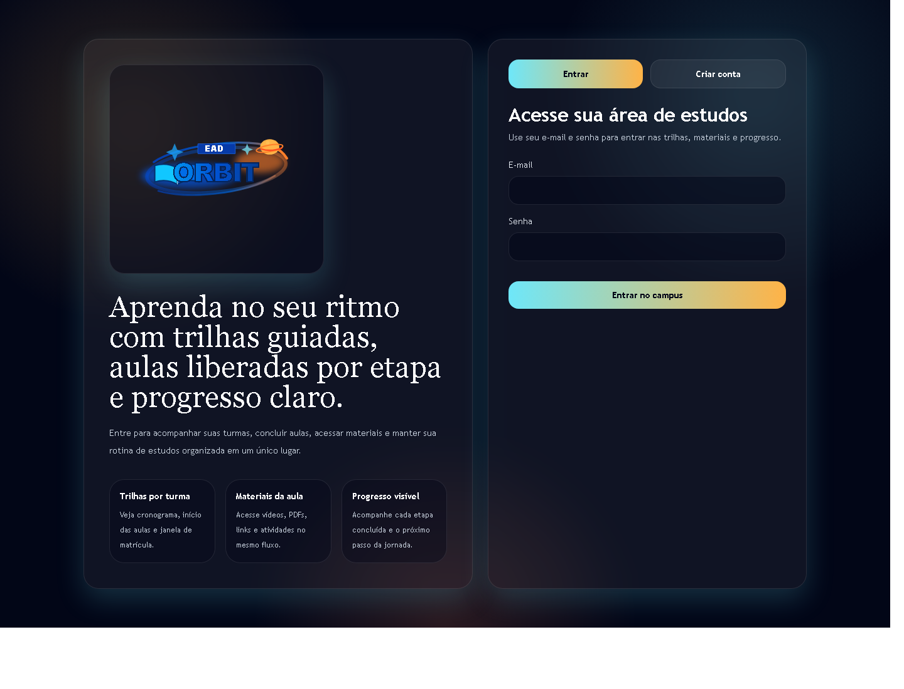

## Dashboard do aluno

Arquivo: `docs/frontend-prints/02-dashboard-aluno.png`

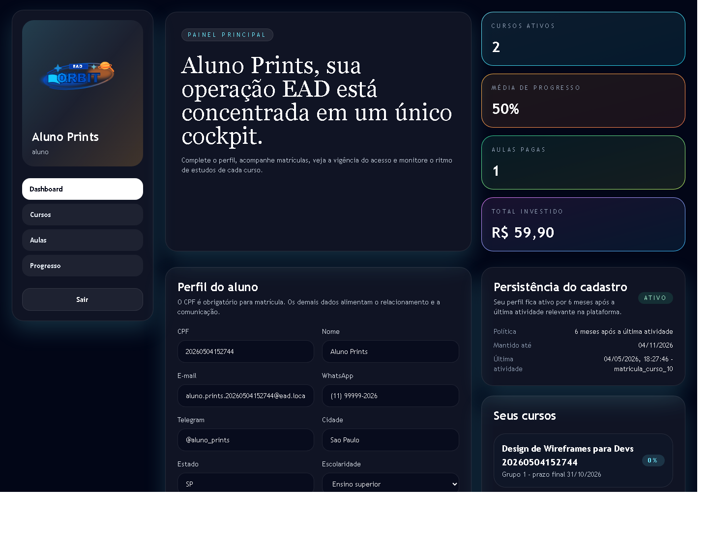

## Catalogo do aluno

Arquivo: `docs/frontend-prints/03-catalogo-aluno.png`

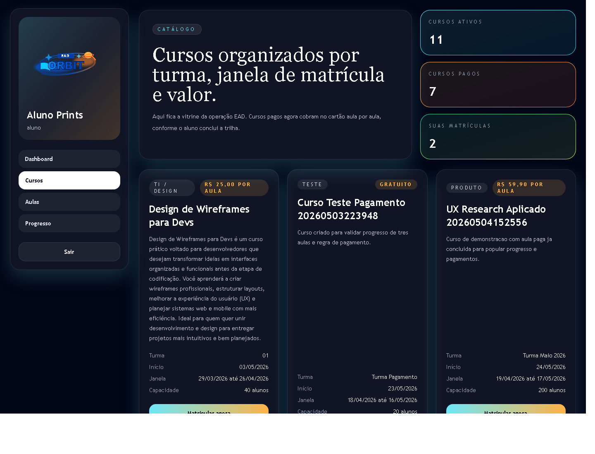

## Aulas do aluno

Arquivo: `docs/frontend-prints/04-aulas-aluno.png`

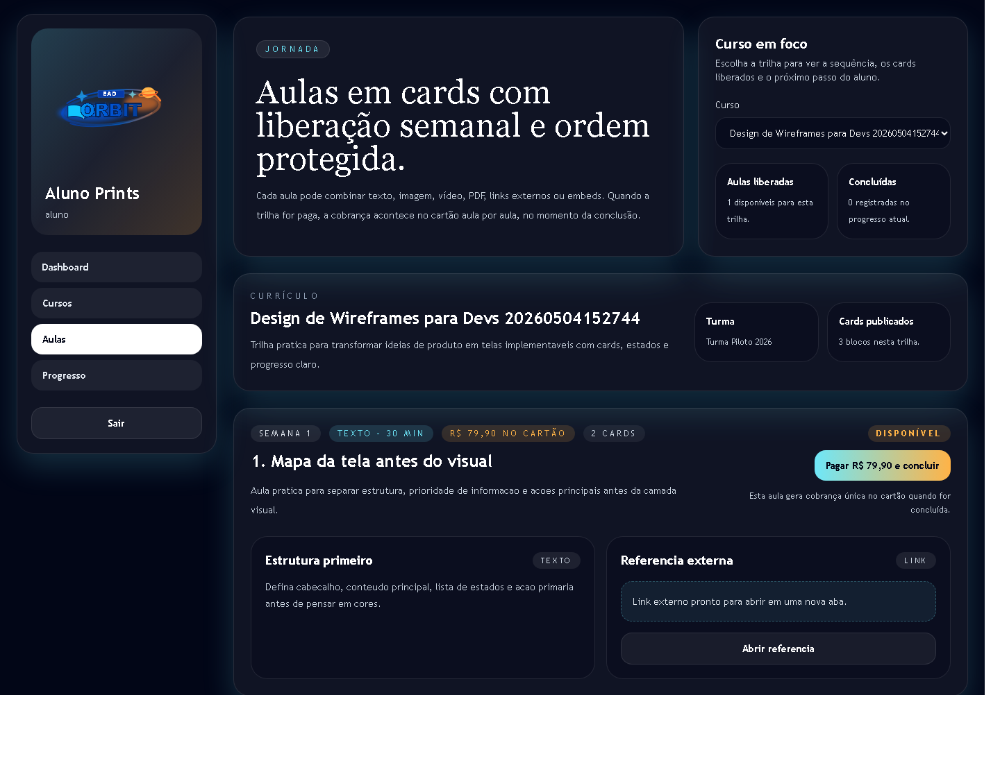

## Progresso do aluno

Arquivo: `docs/frontend-prints/05-progresso-aluno.png`

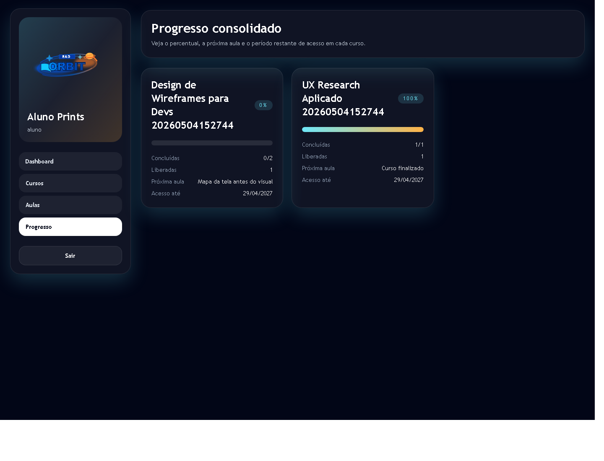

## Dashboard administrativo

Arquivo: `docs/frontend-prints/06-dashboard-admin.png`

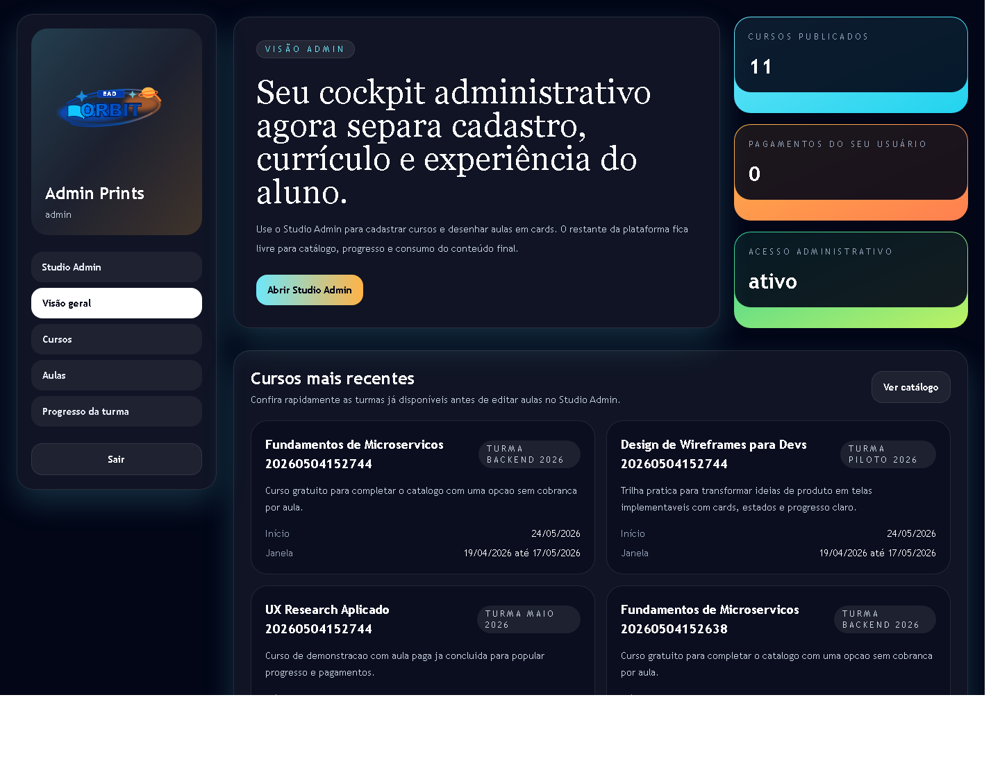

## Studio Admin

Arquivo: `docs/frontend-prints/07-studio-admin.png`

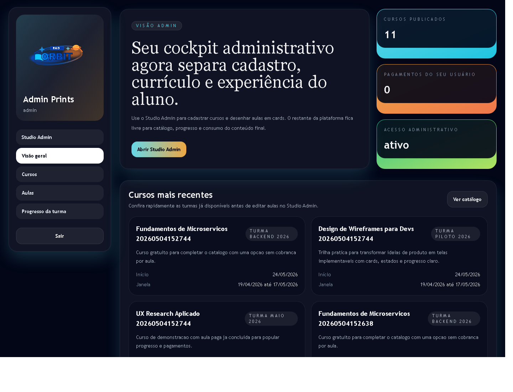

## Catalogo administrativo

Arquivo: `docs/frontend-prints/08-catalogo-admin.png`

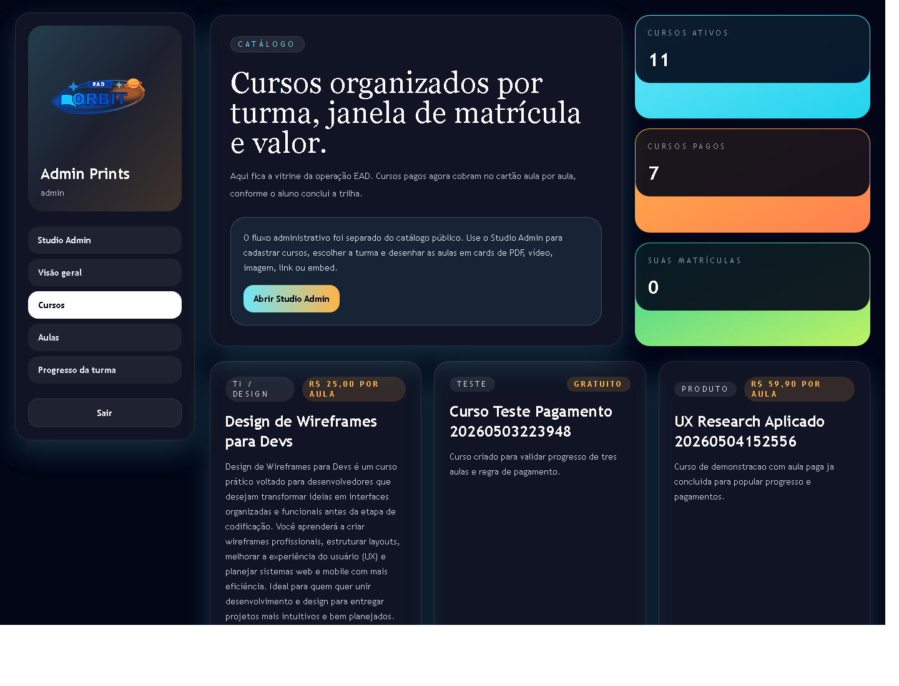

## Aulas administrativo

Arquivo: `docs/frontend-prints/09-aulas-admin.png`

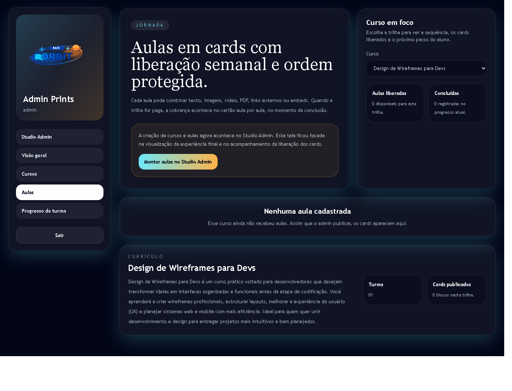

## Progresso administrativo

Arquivo: `docs/frontend-prints/10-progresso-admin.png`

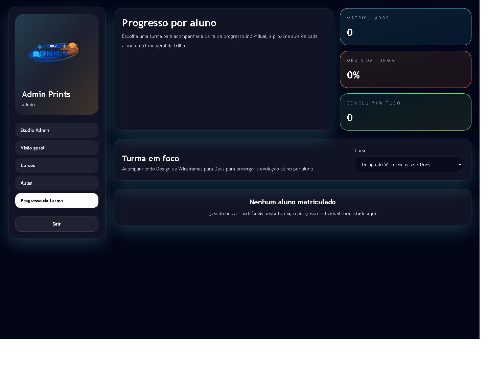

## Dashboard do aluno mobile

Arquivo: `docs/frontend-prints/11-mobile-dashboard-aluno.png`

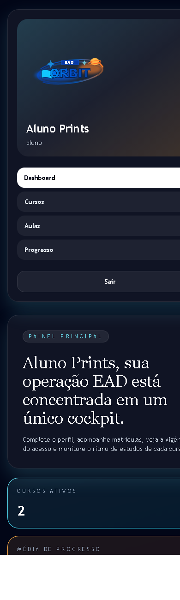
