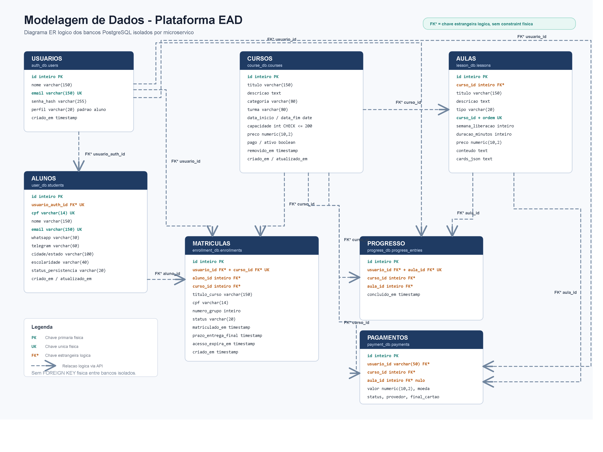
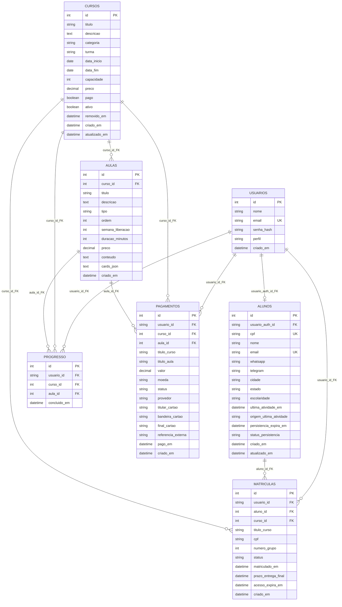

# Modelo de Dados

Este documento consolida o estado atual dos bancos PostgreSQL da stack.
Para apresentacao academica com entidades e atributos em portugues, consulte `NOMENCLATURA_ENTIDADES_BD_PT_BR.md`.

Fontes usadas:

- Consulta direta aos containers Postgres via `docker compose exec ... psql -c "\d+ ..."`
- Scripts de schema em `services/*/sql/schema.sql`
- Modelos SQLAlchemy em `services/*/app/main.py`

## Visao geral

A aplicacao usa um banco isolado por microservico. Por isso, nao existem foreign keys fisicas entre tabelas. As relacoes abaixo sao logicas, mantidas por IDs trafegados entre APIs.

No diagrama, `FK*` significa chave estrangeira logica: o campo referencia dados de outro servico, mas nao existe uma constraint `FOREIGN KEY` criada no PostgreSQL.

| Servico | Banco | Tabela principal |
| --- | --- | --- |
| `auth-service` | `auth_db` | `users` |
| `user-service` | `user_db` | `students` |
| `course-service` | `course_db` | `courses` |
| `lesson-service` | `lesson_db` | `lessons` |
| `enrollment-service` | `enrollment_db` | `enrollments` |
| `progress-service` | `progress_db` | `progress_entries` |
| `payment-service` | `payment_db` | `payments` |

## Diagrama ER logico

## FKs logicas / relacionamentos logicos

As FKs abaixo sao referencias logicas entre servicos. Elas orientam as APIs, consultas e regras de negocio, mas nao aparecem como constraints `FOREIGN KEY` no banco.

| Origem | Destino | Campo | Observacao |
| --- | --- | --- | --- |
| `students.auth_user_id` | `users.id` | `auth_user_id` | O JWT usa `sub = str(users.id)`, por isso o campo e `varchar(50)`. |
| `enrollments.user_id` | `users.id` / `students.auth_user_id` | `user_id` | Identifica o usuario autenticado matriculado. |
| `enrollments.student_id` | `students.id` | `student_id` | Snapshot do perfil do aluno usado na matricula. |
| `enrollments.course_id` | `courses.id` | `course_id` | Curso matriculado. |
| `lessons.course_id` | `courses.id` | `course_id` | Curso ao qual a aula pertence. |
| `progress_entries.user_id` | `users.id` / `students.auth_user_id` | `user_id` | Usuario que concluiu a aula. |
| `progress_entries.course_id` | `courses.id` | `course_id` | Curso da conclusao. |
| `progress_entries.lesson_id` | `lessons.id` | `lesson_id` | Aula concluida. |
| `payments.user_id` | `users.id` / `students.auth_user_id` | `user_id` | Usuario que pagou. |
| `payments.course_id` | `courses.id` | `course_id` | Curso associado ao pagamento. |
| `payments.lesson_id` | `lessons.id` | `lesson_id` | Aula paga; coluna aceita nulo no banco, mas a API exige valor ao criar pagamento. |

## Dicionario das tabelas

### `auth_db.users`

| Coluna | Tipo | Nulo | Default | Restricoes / indices |
| --- | --- | --- | --- | --- |
| `id` | `integer` | nao | `nextval('users_id_seq')` | PK |
| `name` | `varchar(150)` | nao | - | - |
| `email` | `varchar(150)` | nao | - | UK, `idx_auth_users_email` |
| `hashed_password` | `varchar(255)` | nao | - | - |
| `role` | `varchar(20)` | nao | `aluno` | Valores pela API: `admin`, `aluno` |
| `created_at` | `timestamp` | nao | `CURRENT_TIMESTAMP` | - |

### `user_db.students`

| Coluna | Tipo | Nulo | Default | Restricoes / indices |
| --- | --- | --- | --- | --- |
| `id` | `integer` | nao | `nextval('students_id_seq')` | PK |
| `auth_user_id` | `varchar(50)` | nao | - | UK, `idx_students_auth_user_id` |
| `cpf` | `varchar(14)` | nao | - | UK, `idx_students_cpf` |
| `name` | `varchar(150)` | nao | - | - |
| `email` | `varchar(150)` | nao | - | UK |
| `whatsapp` | `varchar(30)` | sim | - | - |
| `telegram` | `varchar(60)` | sim | - | - |
| `city` | `varchar(100)` | nao | - | - |
| `state` | `varchar(100)` | nao | - | - |
| `education_level` | `varchar(40)` | nao | `medio` | - |
| `last_activity_at` | `timestamp` | sim | - | - |
| `last_activity_source` | `varchar(80)` | sim | - | - |
| `persistence_expires_at` | `timestamp` | sim | - | - |
| `persistence_status` | `varchar(20)` | nao | `active` | Valores pela API: `active`, `expired` |
| `created_at` | `timestamp` | nao | `CURRENT_TIMESTAMP` | - |
| `updated_at` | `timestamp` | nao | `CURRENT_TIMESTAMP` | - |

### `course_db.courses`

| Coluna | Tipo | Nulo | Default | Restricoes / indices |
| --- | --- | --- | --- | --- |
| `id` | `integer` | nao | `nextval('courses_id_seq')` | PK |
| `title` | `varchar(150)` | nao | - | - |
| `description` | `text` | nao | - | - |
| `category` | `varchar(80)` | sim | - | - |
| `cohort_name` | `varchar(80)` | nao | - | - |
| `start_date` | `date` | nao | - | - |
| `end_date` | `date` | nao | - | - |
| `capacity` | `integer` | nao | `200` | CHECK `capacity <= 200` |
| `price` | `numeric(10,2)` | nao | `0` | - |
| `is_paid` | `boolean` | nao | `false` | - |
| `is_active` | `boolean` | nao | `true` | - |
| `deleted_at` | `timestamp` | sim | - | Soft delete |
| `created_at` | `timestamp` | nao | `CURRENT_TIMESTAMP` | - |
| `updated_at` | `timestamp` | nao | `CURRENT_TIMESTAMP` | - |

### `lesson_db.lessons`

| Coluna | Tipo | Nulo | Default | Restricoes / indices |
| --- | --- | --- | --- | --- |
| `id` | `integer` | nao | `nextval('lessons_id_seq')` | PK |
| `course_id` | `integer` | nao | - | `idx_lessons_course` |
| `title` | `varchar(150)` | nao | - | - |
| `description` | `text` | nao | - | - |
| `type` | `varchar(20)` | nao | - | Valores pela API: `video`, `texto`, `atividade` |
| `order_index` | `integer` | nao | - | UK com `course_id` em `uq_course_order` |
| `release_week` | `integer` | nao | - | - |
| `duration_minutes` | `integer` | nao | - | Definido pela API conforme `type` |
| `price` | `numeric(10,2)` | nao | `0` | - |
| `content` | `text` | sim | - | Conteudo textual/fallback |
| `cards_json` | `text` | nao | `[]` | JSON serializado de cards |
| `created_at` | `timestamp` | nao | `CURRENT_TIMESTAMP` | - |

### `enrollment_db.enrollments`

| Coluna | Tipo | Nulo | Default | Restricoes / indices |
| --- | --- | --- | --- | --- |
| `id` | `integer` | nao | `nextval('enrollments_id_seq')` | PK |
| `user_id` | `varchar(50)` | nao | - | `idx_enrollments_user`, UK com `course_id` em `uq_user_course` |
| `student_id` | `integer` | nao | - | - |
| `course_id` | `integer` | nao | - | `idx_enrollments_course`, UK com `user_id` em `uq_user_course` |
| `course_title` | `varchar(150)` | nao | - | Snapshot do titulo do curso |
| `cpf` | `varchar(14)` | nao | - | Snapshot do CPF |
| `group_number` | `integer` | nao | - | Grupos gerados em blocos de 5 alunos |
| `status` | `varchar(20)` | nao | `active` | - |
| `enrolled_at` | `timestamp` | nao | `CURRENT_TIMESTAMP` | - |
| `final_delivery_deadline` | `timestamp` | nao | - | Criado como `enrolled_at + 180 dias` |
| `access_expires_at` | `timestamp` | nao | - | Criado como `enrolled_at + 360 dias` |
| `created_at` | `timestamp` | nao | `CURRENT_TIMESTAMP` | - |

### `progress_db.progress_entries`

| Coluna | Tipo | Nulo | Default | Restricoes / indices |
| --- | --- | --- | --- | --- |
| `id` | `integer` | nao | `nextval('progress_entries_id_seq')` | PK |
| `user_id` | `varchar(50)` | nao | - | `idx_progress_user`, UK com `lesson_id` em `uq_user_lesson` |
| `course_id` | `integer` | nao | - | `idx_progress_course` |
| `lesson_id` | `integer` | nao | - | UK com `user_id` em `uq_user_lesson` |
| `completed_at` | `timestamp` | nao | `CURRENT_TIMESTAMP` | - |

### `payment_db.payments`

| Coluna | Tipo | Nulo | Default | Restricoes / indices |
| --- | --- | --- | --- | --- |
| `id` | `integer` | nao | `nextval('payments_id_seq')` | PK |
| `user_id` | `varchar(50)` | nao | - | `idx_payments_user` |
| `course_id` | `integer` | nao | - | `idx_payments_course` |
| `lesson_id` | `integer` | sim | - | `idx_payments_lesson`; API exige ao criar |
| `course_title` | `varchar(150)` | nao | - | Snapshot do titulo do curso |
| `lesson_title` | `varchar(150)` | sim | - | Snapshot do titulo da aula |
| `amount` | `numeric(10,2)` | nao | `0` | - |
| `currency` | `varchar(10)` | nao | `BRL` | API envia em maiusculo |
| `status` | `varchar(20)` | nao | `paid` | Atualmente criado como `paid` |
| `provider` | `varchar(50)` | nao | `credit_card` | API aceita `credit_card` |
| `card_holder_name` | `varchar(150)` | sim | - | - |
| `card_brand` | `varchar(30)` | sim | - | Detectado pela API |
| `card_last_four` | `varchar(4)` | sim | - | Ultimos 4 digitos |
| `external_reference` | `varchar(100)` | sim | - | Gerado se nao informado |
| `paid_at` | `timestamp` | nao | `CURRENT_TIMESTAMP` | - |
| `created_at` | `timestamp` | nao | `CURRENT_TIMESTAMP` | - |

## Constraints e indices

| Tabela | Nome | Tipo | Campos |
| --- | --- | --- | --- |
| `users` | `users_pkey` | Primary key | `id` |
| `users` | `users_email_key` | Unique | `email` |
| `users` | `idx_auth_users_email` | Index | `email` |
| `students` | `students_pkey` | Primary key | `id` |
| `students` | `students_auth_user_id_key` | Unique | `auth_user_id` |
| `students` | `students_cpf_key` | Unique | `cpf` |
| `students` | `students_email_key` | Unique | `email` |
| `students` | `idx_students_auth_user_id` | Index | `auth_user_id` |
| `students` | `idx_students_cpf` | Index | `cpf` |
| `courses` | `courses_pkey` | Primary key | `id` |
| `courses` | `courses_capacity_check` | Check | `capacity <= 200` |
| `lessons` | `lessons_pkey` | Primary key | `id` |
| `lessons` | `uq_course_order` | Unique | `course_id`, `order_index` |
| `lessons` | `idx_lessons_course` | Index | `course_id` |
| `enrollments` | `enrollments_pkey` | Primary key | `id` |
| `enrollments` | `uq_user_course` | Unique | `user_id`, `course_id` |
| `enrollments` | `idx_enrollments_user` | Index | `user_id` |
| `enrollments` | `idx_enrollments_course` | Index | `course_id` |
| `progress_entries` | `progress_entries_pkey` | Primary key | `id` |
| `progress_entries` | `uq_user_lesson` | Unique | `user_id`, `lesson_id` |
| `progress_entries` | `idx_progress_user` | Index | `user_id` |
| `progress_entries` | `idx_progress_course` | Index | `course_id` |
| `payments` | `payments_pkey` | Primary key | `id` |
| `payments` | `idx_payments_user` | Index | `user_id` |
| `payments` | `idx_payments_course` | Index | `course_id` |
| `payments` | `idx_payments_lesson` | Index | `lesson_id` |

## Observacoes tecnicas

- Nao ha nenhuma foreign key fisica no schema atual.
- `user_id` e `auth_user_id` armazenam o `sub` do JWT, que e o `users.id` convertido para string.
- `course_title`, `cpf` e `lesson_title` funcionam como snapshots para preservar historico basico mesmo se os dados originais mudarem.
- `cards_json` guarda uma lista JSON serializada; os tipos de card validos pela API sao `texto`, `imagem`, `video`, `pdf`, `link` e `embed`.
- Alguns campos foram adicionados tambem por migracoes simples em startup (`ALTER TABLE ... ADD COLUMN IF NOT EXISTS`), nao por ferramenta de migrations versionadas.
