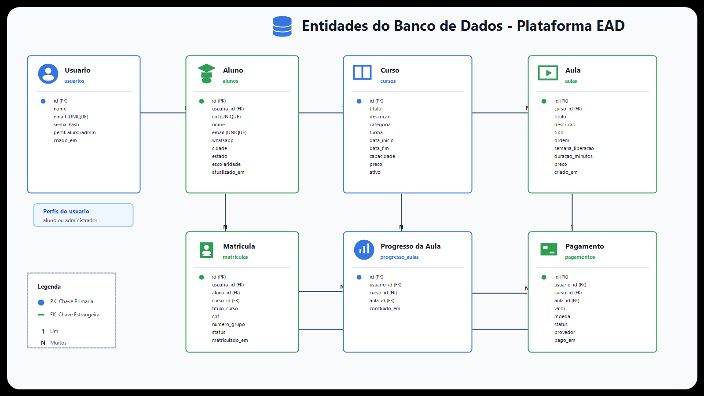
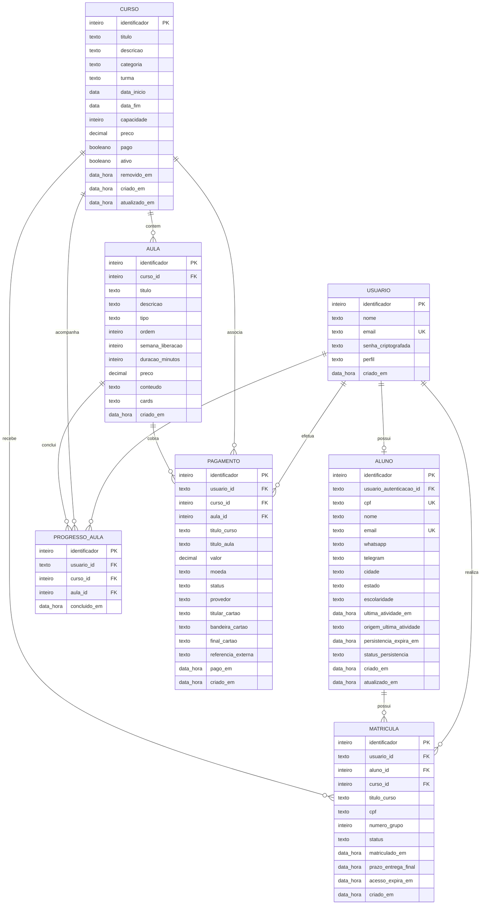

# Nomenclatura das Entidades do BD - Versao para Apresentacao

Este documento usa nomes em portugues para facilitar a apresentacao academica da modelagem de dados.
No codigo-fonte e nos bancos PostgreSQL, as tabelas e colunas continuam com nomes em ingles.

## Entidades principais

| Entidade para apresentacao | O que representa |
| --- | --- |
| Usuario | Conta autenticada que acessa o sistema |
| Aluno | Perfil academico vinculado a um usuario |
| Curso | Curso ofertado na plataforma |
| Aula | Aula pertencente a um curso |
| Matricula | Vinculo entre aluno, usuario e curso |
| Progresso da Aula | Registro de aula concluida pelo aluno |
| Pagamento | Registro de pagamento de curso ou aula |

## Diagrama ER com nomes em portugues

## Atributos por entidade

### Usuario

| Atributo | Tipo logico | Descricao |
| --- | --- | --- |
| Identificador | Inteiro | Codigo unico do usuario |
| Nome | Texto | Nome do usuario |
| E-mail | Texto | E-mail usado para login |
| Senha criptografada | Texto | Senha armazenada de forma protegida |
| Perfil | Texto | Tipo de acesso, como aluno ou administrador |
| Criado em | Data e hora | Data de criacao do usuario |

### Aluno

| Atributo | Tipo logico | Descricao |
| --- | --- | --- |
| Identificador | Inteiro | Codigo unico do aluno |
| Usuario de autenticacao | Texto | Referencia ao usuario que faz login |
| CPF | Texto | Documento do aluno |
| Nome | Texto | Nome completo do aluno |
| E-mail | Texto | E-mail de contato |
| WhatsApp | Texto | Telefone de contato |
| Telegram | Texto | Usuario ou contato no Telegram |
| Cidade | Texto | Cidade do aluno |
| Estado | Texto | Estado do aluno |
| Escolaridade | Texto | Nivel de escolaridade |
| Ultima atividade | Data e hora | Ultimo uso registrado na plataforma |
| Origem da ultima atividade | Texto | Tela ou acao que gerou a atividade |
| Expiracao da persistencia | Data e hora | Prazo usado para manter o cadastro ativo |
| Status de persistencia | Texto | Situacao do cadastro do aluno |
| Criado em | Data e hora | Data de criacao do perfil |
| Atualizado em | Data e hora | Data da ultima atualizacao do perfil |

### Curso

| Atributo | Tipo logico | Descricao |
| --- | --- | --- |
| Identificador | Inteiro | Codigo unico do curso |
| Titulo | Texto | Nome do curso |
| Descricao | Texto | Explicacao do conteudo do curso |
| Categoria | Texto | Area ou classificacao do curso |
| Turma | Texto | Nome da turma ofertada |
| Data de inicio | Data | Inicio do curso |
| Data de fim | Data | Fim do curso |
| Capacidade | Inteiro | Quantidade maxima de alunos |
| Preco | Decimal | Valor cobrado pelo curso |
| Pago | Booleano | Indica se o curso e pago |
| Ativo | Booleano | Indica se o curso esta disponivel |
| Removido em | Data e hora | Data de remocao logica |
| Criado em | Data e hora | Data de criacao do curso |
| Atualizado em | Data e hora | Data da ultima atualizacao do curso |

### Aula

| Atributo | Tipo logico | Descricao |
| --- | --- | --- |
| Identificador | Inteiro | Codigo unico da aula |
| Curso | Inteiro | Curso ao qual a aula pertence |
| Titulo | Texto | Nome da aula |
| Descricao | Texto | Resumo da aula |
| Tipo | Texto | Tipo da aula, como video, texto ou atividade |
| Ordem | Inteiro | Posicao da aula dentro do curso |
| Semana de liberacao | Inteiro | Semana em que a aula fica disponivel |
| Duracao em minutos | Inteiro | Tempo estimado da aula |
| Preco | Decimal | Valor da aula quando houver cobranca |
| Conteudo | Texto | Conteudo principal ou complementar |
| Cards | Texto | Blocos de conteudo multimidia da aula |
| Criado em | Data e hora | Data de criacao da aula |

### Matricula

| Atributo | Tipo logico | Descricao |
| --- | --- | --- |
| Identificador | Inteiro | Codigo unico da matricula |
| Usuario | Texto | Usuario autenticado vinculado a matricula |
| Aluno | Inteiro | Perfil de aluno vinculado a matricula |
| Curso | Inteiro | Curso em que o aluno foi matriculado |
| Titulo do curso | Texto | Nome do curso salvo no momento da matricula |
| CPF | Texto | CPF salvo no momento da matricula |
| Numero do grupo | Inteiro | Grupo automatico do aluno |
| Status | Texto | Situacao da matricula |
| Matriculado em | Data e hora | Data em que a matricula foi feita |
| Prazo de entrega final | Data e hora | Prazo final para entrega das atividades |
| Expiracao do acesso | Data e hora | Data limite de acesso ao curso |
| Criado em | Data e hora | Data de criacao do registro |

### Progresso da Aula

| Atributo | Tipo logico | Descricao |
| --- | --- | --- |
| Identificador | Inteiro | Codigo unico do registro de progresso |
| Usuario | Texto | Usuario que concluiu a aula |
| Curso | Inteiro | Curso relacionado ao progresso |
| Aula | Inteiro | Aula concluida |
| Concluido em | Data e hora | Data em que a aula foi concluida |

### Pagamento

| Atributo | Tipo logico | Descricao |
| --- | --- | --- |
| Identificador | Inteiro | Codigo unico do pagamento |
| Usuario | Texto | Usuario que realizou o pagamento |
| Curso | Inteiro | Curso associado ao pagamento |
| Aula | Inteiro | Aula associada ao pagamento |
| Titulo do curso | Texto | Nome do curso salvo no pagamento |
| Titulo da aula | Texto | Nome da aula salva no pagamento |
| Valor | Decimal | Valor pago |
| Moeda | Texto | Moeda usada no pagamento |
| Status | Texto | Situacao do pagamento |
| Provedor | Texto | Meio ou provedor de pagamento |
| Titular do cartao | Texto | Nome impresso no cartao |
| Bandeira do cartao | Texto | Bandeira identificada do cartao |
| Final do cartao | Texto | Ultimos quatro digitos do cartao |
| Referencia externa | Texto | Codigo externo de referencia |
| Pago em | Data e hora | Data de confirmacao do pagamento |
| Criado em | Data e hora | Data de criacao do registro |

## Correspondencia com os nomes reais do projeto

| Nome para apresentacao | Classe no codigo | Tabela real |
| --- | --- | --- |
| Usuario | `User` | `users` |
| Aluno | `Student` | `students` |
| Curso | `Course` | `courses` |
| Aula | `Lesson` | `lessons` |
| Matricula | `Enrollment` | `enrollments` |
| Progresso da Aula | `ProgressEntry` | `progress_entries` |
| Pagamento | `Payment` | `payments` |

## Observacao para defesa/apresentacao

Na apresentacao, os nomes em portugues ajudam a explicar o dominio do sistema para o professor.
Na implementacao, os nomes reais foram mantidos em ingles por convencao tecnica comum em codigo, APIs e bancos de dados.
Como o sistema usa microservicos com bancos separados, os relacionamentos apresentados sao logicos, isto e, os IDs trafegam entre servicos, mas nao existem chaves estrangeiras fisicas entre bancos diferentes.
