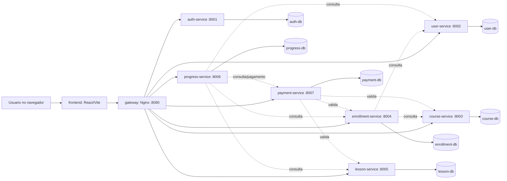
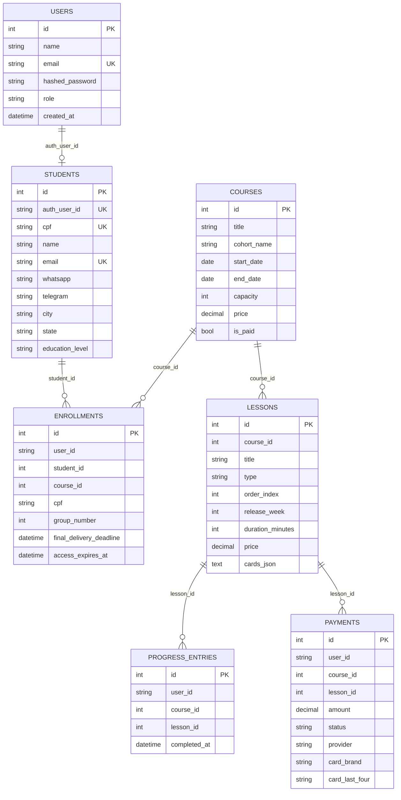
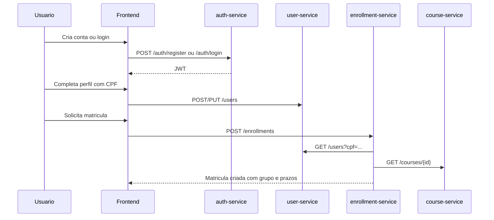
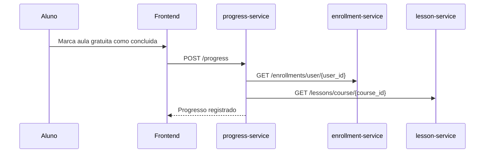
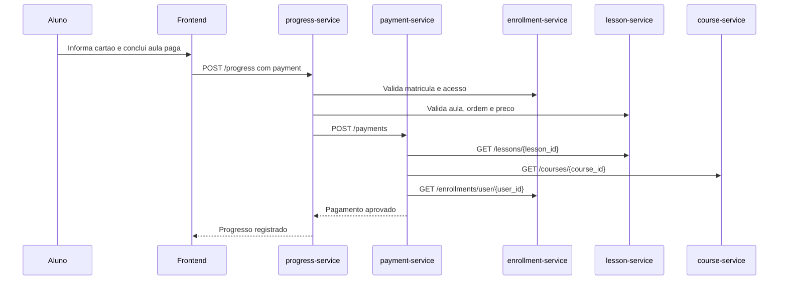
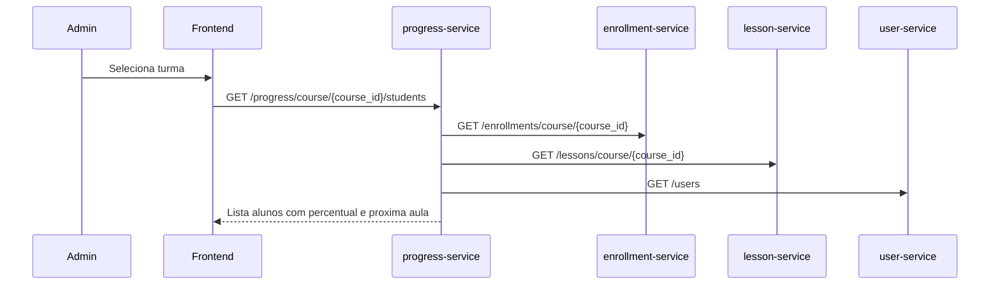

# Plataforma EAD em Microservicos - Documentacao Tecnica e Funcional

Data de referencia: 24/04/2026

## 1. Visao geral

Este projeto implementa uma plataforma EAD com frontend React, API Gateway Nginx, sete microservicos FastAPI e bancos PostgreSQL isolados por servico.

O sistema cobre o fluxo principal de uma operacao EAD:

- Cadastro e autenticacao de usuarios.
- Cadastro de perfil de aluno por CPF.
- Catalogo de cursos e turmas.
- Matricula por CPF dentro de janela operacional.
- Criacao de aulas em cards multimidia.
- Liberacao semanal e sequencial das aulas.
- Conclusao de aula com progresso por aluno.
- Pagamento por aula paga no cartao de credito.
- Visao administrativa de progresso da turma.

## 2. Stack

| Camada | Tecnologia |
| --- | --- |
| Frontend | React 18, Vite, Tailwind CSS |
| Gateway | Nginx 1.27 Alpine |
| Backend | FastAPI, Pydantic, SQLAlchemy |
| Autenticacao | JWT HS256, python-jose, passlib/bcrypt |
| Banco de dados | PostgreSQL 16, um banco por servico |
| Orquestracao | Docker Compose |
| Documentacao gerada | Markdown + PDF com ReportLab |

## 3. Arquitetura



## 4. Organizacao do repositorio

```text
gateway/
  nginx.conf
frontend/
  src/App.jsx
  package.json
services/
  auth-service/
  user-service/
  course-service/
  enrollment-service/
  lesson-service/
  progress-service/
  payment-service/
docs/
  FRONTEND_PRINTS.md
  frontend-prints/
  MODELO_DE_DADOS.md
  NOMENCLATURA_ENTIDADES_BD_PT_BR.md
  SISTEMA_EAD_DOCUMENTACAO.md
  SISTEMA_EAD_DOCUMENTACAO.pdf
  entidades-bd-plataforma-ead-pt-br.png
  modelagem-dados.png
docker-compose.yml
README.md
```

## 5. Portas e roteamento

| Componente | Porta externa | Porta interna | Rotas gateway |
| --- | ---: | ---: | --- |
| frontend | 3000 | 80 | N/A |
| gateway | 8080 | 80 | `/auth`, `/users`, `/courses`, `/enrollments`, `/lessons`, `/progress`, `/payments` |
| auth-service | 8001 | 8000 | `/auth/*` |
| user-service | 8002 | 8000 | `/users/*` |
| course-service | 8003 | 8000 | `/courses/*` |
| enrollment-service | 8004 | 8000 | `/enrollments/*` |
| lesson-service | 8005 | 8000 | `/lessons/*` |
| progress-service | 8006 | 8000 | `/progress/*` |
| payment-service | 8007 | 8000 | `/payments/*` |

## 6. Servicos

### 6.1 auth-service

Responsavel por registro, login, JWT e roles.

Endpoints:

| Metodo | Rota | Descricao |
| --- | --- | --- |
| GET | `/health` | Saude do servico |
| POST | `/auth/register` | Cria usuario `aluno` ou `admin` |
| POST | `/auth/login` | Autentica e retorna JWT |
| GET | `/auth/me` | Retorna usuario autenticado |

Regras:

- Roles permitidas: `admin`, `aluno`.
- Registro de admin exige `ADMIN_REGISTRATION_CODE`.
- JWT contem `sub`, `name`, `email`, `role` e `exp`.

Tabela principal: `users`.

### 6.2 user-service

Responsavel pelo perfil do aluno.

Endpoints:

| Metodo | Rota | Descricao |
| --- | --- | --- |
| GET | `/health` | Saude do servico |
| GET | `/users` | Lista alunos; filtros por `cpf` e `auth_user_id` |
| POST | `/users` | Cria perfil do aluno |
| PUT | `/users/{user_id}` | Atualiza perfil |
| DELETE | `/users/{user_id}` | Remove perfil |

Campos do perfil:

- `auth_user_id`
- `cpf`
- `name`
- `email`
- `whatsapp`
- `telegram`
- `city`
- `state`
- `education_level`

Regras:

- CPF unico.
- E-mail unico no perfil.
- Usuario comum so cria/edita o proprio perfil.
- Admin pode listar e editar outros perfis.
- O campo `education_level` foi adicionado com default `medio`.

Tabela principal: `students`.

### 6.3 course-service

Responsavel por catalogo, turmas e janela calculada de matricula.

Endpoints:

| Metodo | Rota | Descricao |
| --- | --- | --- |
| GET | `/health` | Saude do servico |
| GET | `/courses` | Lista cursos |
| GET | `/courses/{course_id}` | Detalha curso |
| POST | `/courses` | Cria curso; admin |
| PUT | `/courses/{course_id}` | Atualiza curso; admin |

Campos principais:

- `title`
- `description`
- `category`
- `cohort_name`
- `start_date`
- `end_date`
- `capacity`
- `price`
- `is_paid`
- `is_active`

Regras:

- Capacidade maxima de 200 alunos.
- `end_date` deve ser posterior a `start_date`.
- `is_paid` e derivado de `price > 0`, quando nao informado.
- Resposta inclui `enrollment_window_open` e `enrollment_window_close`, calculadas como 5 e 1 semanas antes do inicio.

Tabela principal: `courses`.

### 6.4 enrollment-service

Responsavel por matriculas por CPF.

Endpoints:

| Metodo | Rota | Descricao |
| --- | --- | --- |
| GET | `/health` | Saude do servico |
| POST | `/enrollments` | Cria matricula |
| GET | `/enrollments/user/{user_id}` | Lista matriculas de um usuario |
| GET | `/enrollments/course/{course_id}` | Lista matriculas da turma; admin |

Regras:

- A matricula usa CPF para localizar o aluno no `user-service`.
- Usuario comum so pode se matricular no proprio CPF.
- Matricula permitida somente entre 5 e 1 semanas antes do inicio do curso.
- Um aluno nao pode se matricular duas vezes no mesmo curso.
- Respeita capacidade maxima do curso.
- Grupos automaticos de ate 5 alunos: `group_number = floor(current_count / 5) + 1`.
- Prazo de entrega final: 180 dias apos matricula.
- Persistencia de acesso: 360 dias apos matricula.
- Cursos pagos nao exigem pagamento na matricula; a cobranca ocorre na conclusao das aulas pagas.

Tabela principal: `enrollments`.

### 6.5 lesson-service

Responsavel por curriculo, aulas e cards.

Endpoints:

| Metodo | Rota | Descricao |
| --- | --- | --- |
| GET | `/health` | Saude do servico |
| GET | `/lessons/course/{course_id}` | Lista aulas de um curso |
| GET | `/lessons/{lesson_id}` | Detalha aula |
| POST | `/lessons` | Cria aula; admin |

Tipos de aula:

| Tipo | Duracao |
| --- | ---: |
| `video` | 30 min |
| `texto` | 30 min |
| `atividade` | 60 min |

Cards suportados:

- `texto`
- `imagem`
- `video`
- `pdf`
- `link`
- `embed`

Regras:

- Cada curso pode ter no maximo 40 aulas.
- `order_index` e unico por curso.
- `release_week` segue a ordem da aula.
- Aulas pagas usam o campo `price`.
- Cards ficam serializados em `cards_json`.
- O servico possui migracao para `cards_json` e `price` em bancos antigos.

Tabela principal: `lessons`.

### 6.6 progress-service

Responsavel por progresso, sequencia, liberacao semanal e consulta administrativa da turma.

Endpoints:

| Metodo | Rota | Descricao |
| --- | --- | --- |
| GET | `/health` | Saude do servico |
| POST | `/progress` | Marca aula como concluida |
| GET | `/progress/{user_id}` | Lista progresso por curso do usuario |
| GET | `/progress/course/{course_id}/students` | Lista progresso dos alunos da turma; admin |

Regras:

- Usuario comum so marca progresso para si mesmo.
- A matricula precisa existir.
- Acesso nao pode estar expirado.
- A aula precisa existir no curso informado.
- A aula precisa estar liberada pela semana da matricula.
- A ordem das aulas precisa ser respeitada.
- Se a aula tiver preco maior que zero e ainda nao houver pagamento aprovado, o payload precisa conter dados de pagamento.
- Quando necessario, o servico chama `payment-service` e so registra o progresso se o pagamento for aceito.

Tabela principal: `progress_entries`.

### 6.7 payment-service

Responsavel por registrar pagamento por aula.

Endpoints:

| Metodo | Rota | Descricao |
| --- | --- | --- |
| GET | `/health` | Saude do servico |
| POST | `/payments` | Registra pagamento de uma aula |
| GET | `/payments/{user_id}` | Lista pagamentos de um usuario |

Payload de pagamento:

- `user_id`
- `course_id`
- `lesson_id`
- `amount`
- `currency`
- `provider = credit_card`
- `card_holder_name`
- `card_number`
- `expiry_month`
- `expiry_year`
- `cvv`
- `external_reference`

Dados persistidos:

- Valor, status, curso e aula.
- Nome no cartao.
- Bandeira inferida.
- Ultimos quatro digitos.
- Referencia externa.

Observacao de seguranca: o numero completo do cartao e o CVV sao usados somente para validacao simples em memoria e nao sao persistidos.

Regras:

- Usuario comum so paga a propria aula.
- Um pagamento aprovado por aula e usuario impede duplicidade.
- A aula deve pertencer ao curso informado.
- A aula precisa ter preco maior que zero.
- A matricula precisa existir.
- O periodo de acesso nao pode estar expirado.
- A aula precisa estar liberada.
- O valor pago precisa ser exatamente igual ao preco da aula.
- Cartao expirado, numero invalido ou CVV invalido retornam erro.

Tabela principal: `payments`.

## 7. Modelo de dados



Observacao: por isolamento de microservicos, as relacoes acima sao logicas. Nao ha foreign keys entre bancos diferentes.

## 8. Fluxos principais

### 8.1 Registro, perfil e matricula



### 8.2 Conclusao de aula gratuita



### 8.3 Conclusao de aula paga



### 8.4 Painel admin de progresso



## 9. Regras de negocio consolidadas

| Regra | Status |
| --- | --- |
| Login obrigatorio para operacoes de negocio | Implementado |
| Roles `admin` e `aluno` | Implementado |
| Cadastro do aluno por CPF | Implementado |
| CPF unico | Implementado |
| Nome, e-mail, WhatsApp, Telegram, cidade, estado e escolaridade | Implementado |
| Capacidade maxima de 200 alunos por turma | Implementado |
| Grupos automaticos de ate 5 alunos | Implementado |
| Matricula por CPF | Implementado |
| Janela de matricula entre 5 e 1 semanas antes do inicio | Implementado |
| Final delivery em 180 dias | Implementado |
| Acesso por 360 dias | Implementado |
| Curso com ate 40 aulas | Implementado |
| Video 30 min, texto 30 min, atividade 60 min | Implementado |
| Uma aula liberada por semana | Implementado |
| Ordem sequencial obrigatoria | Implementado |
| Cards de texto, imagem, video, PDF, link e embed | Implementado |
| Pagamento por aula paga no momento da conclusao | Implementado |
| Armazenar apenas metadados do cartao | Implementado |
| Progresso individual por aluno na turma | Implementado |
| Prova/atividade ENADE com 30 questoes objetivas | Pendente |
| Debito financeiro no final da semana | Pendente |
| Normalizacao de cidade/estado em tabelas proprias | Pendente |

## 10. Frontend

Rotas principais:

| Rota | Publico | Descricao |
| --- | --- | --- |
| `/login` | Todos | Login e registro |
| `/dashboard` | Autenticado | Perfil, matriculas e resumo |
| `/courses` | Autenticado | Catalogo e matricula |
| `/lessons` | Autenticado | Aulas liberadas, cards, conclusao e pagamento |
| `/admin` | Admin | Studio Admin para cursos e aulas |
| `/progress` | Autenticado | Progresso do aluno ou progresso da turma para admin |

Comportamentos relevantes:

- O frontend usa `VITE_API_URL`, com default `http://localhost:8080`.
- O token JWT e armazenado em `localStorage` como `ead-token`.
- O perfil exige CPF antes da matricula.
- O Studio Admin concentra cadastro de cursos e aulas.
- Em aulas pagas, o modal de cartao abre somente no momento da conclusao.

### 10.1 Prints das telas

Os prints das telas reais do frontend estao em
[`docs/FRONTEND_PRINTS.md`](FRONTEND_PRINTS.md) e na pasta
`docs/frontend-prints/`.

O material cobre:

- Login.
- Dashboard, catalogo, aulas e progresso do aluno.
- Dashboard, catalogo, aulas e progresso administrativo.
- Studio Admin.
- Versao mobile do dashboard do aluno.

## 11. Variaveis de ambiente

| Variavel | Uso | Default |
| --- | --- | --- |
| `JWT_SECRET` | Assinatura JWT compartilhada | `super-secret-jwt-key` |
| `JWT_ALGORITHM` | Algoritmo JWT | `HS256` |
| `ACCESS_TOKEN_EXPIRE_MINUTES` | Duracao do token | `720` |
| `ADMIN_REGISTRATION_CODE` | Codigo de criacao admin | `ead-admin-2026` |
| `VITE_API_URL` | URL base do frontend | `http://localhost:8080` |
| `DATABASE_URL` | Banco por servico | definido no compose |

## 12. Como executar

```bash
docker compose up -d --build
```

Acessos:

- Frontend: `http://localhost:3000`
- Gateway health: `http://localhost:8080/health`
- Swagger Auth: `http://localhost:8001/docs`
- Swagger Users: `http://localhost:8002/docs`
- Swagger Courses: `http://localhost:8003/docs`
- Swagger Enrollments: `http://localhost:8004/docs`
- Swagger Lessons: `http://localhost:8005/docs`
- Swagger Progress: `http://localhost:8006/docs`
- Swagger Payments: `http://localhost:8007/docs`

## 13. Validacao local realizada

Comandos usados para validar o estado atual:

```powershell
Get-ChildItem services -Recurse -Filter main.py | ForEach-Object { .\.venv\Scripts\python.exe -m py_compile $_.FullName }
.\.venv\Scripts\python.exe -c "import sys; sys.path.insert(0, 'services/user-service'); import app.main; print('user main import ok')"
.\.venv\Scripts\python.exe -c "import sys; sys.path.insert(0, 'services/lesson-service'); import app.main; print('lesson main import ok')"
npm run build
docker compose config --quiet
```

Resultado:

- Backend compila.
- `user-service` importa.
- `lesson-service` importa.
- Frontend builda.
- Compose valida a configuracao.

## 14. Riscos e proximos passos recomendados

1. Criar modulo de atividade/prova com 30 questoes objetivas no padrao ENADE.
2. Definir se "debito no final da semana" significa apenas agendamento de cobranca ou liquidacao financeira real.
3. Modelar cidades e estados como tabelas proprias se a normalizacao for requisito obrigatorio.
4. Adicionar testes automatizados para matricula, liberacao semanal, pagamento por aula e progresso.
5. Evoluir validacao de cartao para integracao real com provedor de pagamento, sem persistir PAN/CVV.
6. Criar migrations versionadas formais, substituindo as migracoes simples em startup.
